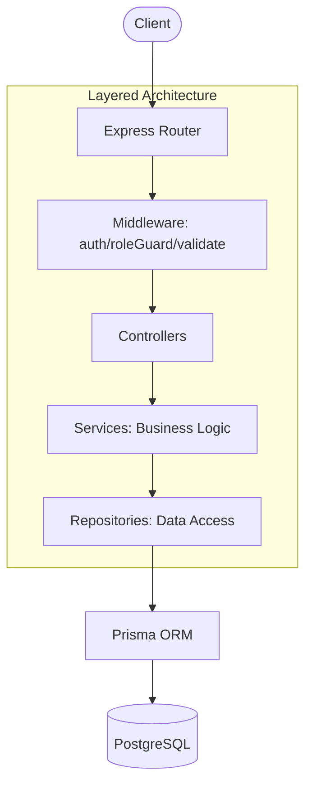

<div align="center">
  <h1>KarmaGrid</h1>
  <p>A role-based backend for coordinating volunteers and organizations — task creation, capacity-safe registration, and transactional concurrency handling built on Express and Prisma.</p>

  <p>
    
    
    
    
  </p>
</div>

## Table of Contents
1. [Why This Project](#why-this-project)
2. [Features](#features)
3. [Architecture](#architecture)
4. [Getting Started (Local Development)](#getting-started-local-development)
5. [API Overview](#api-overview)
6. [Testing Strategy](#testing-strategy)
7. [Roadmap](#roadmap)
8. [License](#license)

## Why This Project
I built KarmaGrid to solve the data integrity and security challenges of volunteer coordination platforms. What makes this implementation interesting is the focus on concurrency-safe, transactional registration that prevents capacity overruns under concurrent load. I approached this with a strict, layered architecture built on production patterns: transactional writes, robust refresh token rotation (hashed at rest), and comprehensive layered testing. Every layer is designed to be fully testable and securely segregated by role.

## Features

### Authentication & Authorization
- Dual-role JWT auth (separate secrets per role) with signup/signin
- Access + refresh token rotation, refresh tokens hashed at rest
- Role-based middleware (verifyToken + requireRole)

### Task & Registration Workflows
- Organization task CRUD with ownership enforcement
- Volunteer browse/filter/register/cancel
- Transactional, concurrency-safe registration (utilizing `Serializable` isolation to prevent TOCTOU race conditions, detailed in the architecture docs)
- Double-registration and capacity-overrun prevention enforced at the database and transaction level, not just application logic

### Testing
- Unit tests (mocked repository layer) and integration tests (real Express app spun up in-memory) using Node's built-in test runner
- A specific test proving the concurrency fix under real simultaneous requests, not just mocked logic

## Architecture



**Current Stack:**
- **Node.js**
- **Express** (v5.2.1)
- **Prisma** (v5.22.0)
- **PostgreSQL** (v15)
- **Zod** (v4.6.5)

For a detailed walkthrough of the implementation, read the [Architecture Document](docs/ARCHITECTURE.md) and the [Phase 2 Architecture Document](docs/PHASE2_ARCHITECTURE.md).

## Getting Started (Local Development)

1. Clone the repository and configure your environment variables based on `.env.example`:
   ```bash
   cp .env.example .env
   ```
   *Make sure to provide your own secure values for `JWT_ORG_SECRET` and `JWT_VOL_SECRET`.*

2. Start the PostgreSQL database:
   ```bash
   docker-compose up -d
   ```

3. Install dependencies:
   ```bash
   npm install
   ```

4. Run migrations and generate the Prisma client:
   ```bash
   npx prisma migrate dev && npx prisma generate
   ```

5. Start the development server:
   ```bash
   npm run dev
   ```

6. Run the test suite (currently 44 passing tests):
   ```bash
   npm test
   ```

## API Overview

| Method | Endpoint | Auth Required |
| :--- | :--- | :--- |
| `POST` | `/organization/signup` | None |
| `POST` | `/organization/signin` | None |
| `POST` | `/volunteer/signup` | None |
| `POST` | `/volunteer/signin` | None |
| `POST` | `/refresh` | None |
| `POST` | `/logout` | None |
| `POST` | `/tasks` | ORG |
| `PATCH` | `/tasks/:id` | ORG |
| `DELETE` | `/tasks/:id` | ORG |
| `GET` | `/tasks` | None |
| `GET` | `/tasks/:id` | None |
| `POST` | `/tasks/:id/register` | VOLUNTEER |
| `DELETE` | `/tasks/:id/register` | VOLUNTEER |
| `GET` | `/tasks/:id/volunteers` | ORG |
| `GET` | `/volunteers/me/tasks` | VOLUNTEER |

## Testing Strategy

Testing relies entirely on Node's built-in test runner (`node:test`). The suite is split into:
- **Unit tests**: Pure logic validation with the database repository layer mocked out via `t.mock.method`.
- **Integration tests**: Spinning up a real, ephemeral Express instance in-memory to test the complete stack.

For details on how the race-condition concurrency tests are structured and verified against the database state, see the [Phase 2 Architecture Document](docs/PHASE2_ARCHITECTURE.md).

## Roadmap

The following features are strictly **NOT YET BUILT** and represent planned functionality:
- Batch ingestion pipeline with chunked upserts and idempotent re-runs
- Background job queue (BullMQ)
- Observability and metrics
- Waitlist management for fully booked tasks
- Certificate generation
- Frontend

## License

ISC
